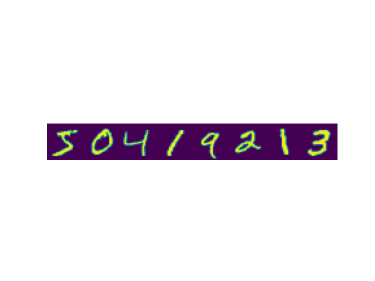

### Convolutional Neural network Exercise

### Task 1 - Find Waldo
In this first task we will use cross-correlation to find Waldo in the image below:

[ Image source: https://rare-gallery.com ]

Recall that cross-correlation, which the machine learning world often refers to as convolution is defined as:

$$ S(i,j) = (\mathbf{K}*\mathbf{I})(i,j) = \sum_{m=0}^{M-1} \sum_{n=0}^{N-1} \mathbf{I}(i+m, j+n)\mathbf{K}(m,n). $$

for an image matrix $\mathbf{I}$ and a kernel matrix $\mathbf{K}$ of shape $(M \times N)$. To find waldo use the waldo-kernel below:

By sliding the waldo-kernel over the image and computing the cross-correlation at each position we can find the position where waldo is located by looking for the maximum value in the resulting matrix.

#### Task 1.1 - Direct convolution
Navigate to the `src/custom_conv.py` module.
1. Start in `my_conv_direct` and implement the convolution following the equation above. Both inputs are `torch.Tensor`s. Test your function with vscode tests or `nox -s test`.
2. Go to `src/waldo.py`. It already uses `my_conv_direct` for convolution. This script finds waldo in the image using your convolution function. Execute it with `python ./src/waldo.py` in your terminal.
3. If your code passes the pytest but is too slow to find waldo feel free to use `scipy.signal.correlate2d` in `src/waldo.py` instead of your convolution function.

#### Task 1.2 (Optional)
Navigate to the `src/custom_conv.py` module.
The function `my_conv` implements a fast version of the convolution operation above using a flattened kernel. We learned about this fast version in the lecture. Have a look at the slides again and then implement `get_indices` to make `my_conv` work. It should return
- A matrix of indices following the flattened convolution rule from the lecture, e.g. for a $(2\times 2)$ kernel and a $(3\times 3)$ image it should return the index transformation

$$
   \begin{pmatrix}
   0 & 1 & 2 \\
   3 & 4 & 5 \\
   6 & 7 & 8 \\
   \end{pmatrix}
   \rightarrow
   \begin{pmatrix}
   0 & 1 & 3 & 4 \\
   1 & 2 & 4 & 5 \\
   3 & 4 & 6 & 7 \\
   4 & 5 & 7 & 8
   \end{pmatrix}  $$

- The number of rows and columns in the result following
   $$o=(i-k)+1$$
   where $i$ denotes the input size and $k$ the kernel size.

If you need help, follow the hints below:
- First create a list of starting indices for each row in the output. These are the upper left corners of each kernel application.
- Then create a list of offsets within the kernel. These are the indices that need to be added to each starting index to get the full set of indices for each kernel application.
- Finally use broadcasting to add the two lists together and get the final index matrix.
The tests for this task (`test_conv_fast` and `test_get_indices_readme_example` in `tests/test_conv.py`) are skipped automatically as long as `get_indices` returns `None`. Once you have implemented it, run `nox -s test` again. Afterwards switch `src/waldo.py` to `my_conv` and run the script again. Watch the memory usage: the index matrix has one row per output pixel and one column per kernel pixel.

### Task 2 - MNIST - Digit recognition

Open `src/mnist.py` and implement MNIST digit recognition with `CNN` in `torch`

- *Reuse* your code from the yesterday's exercise on neural networks: `cross_entropy`, `sgd_step`, `zero_grad`, `get_acc` and the training loop.
- In `cross_entropy`, $n$ is the total number of entries of the label tensor, i.e. batch size $\times$ number of classes:
   $$\mathcal{L} = -\frac{1}{n}\sum_{k=1}^{n} \Big( y_k \log(o_k) + (1-y_k)\log(1-o_k) \Big).$$
- `get_acc` does not need gradients. Use `torch.no_grad()` there, otherwise the evaluation on the 10000 test images builds a large autograd graph.
- Reuse the `Net` from the yesterday's exercise, add convolutional layers and pooling. `torch.nn.Conv2d` and `torch.nn.MaxPool2d` will help you.
- Test your functions with `nox -s test`.
